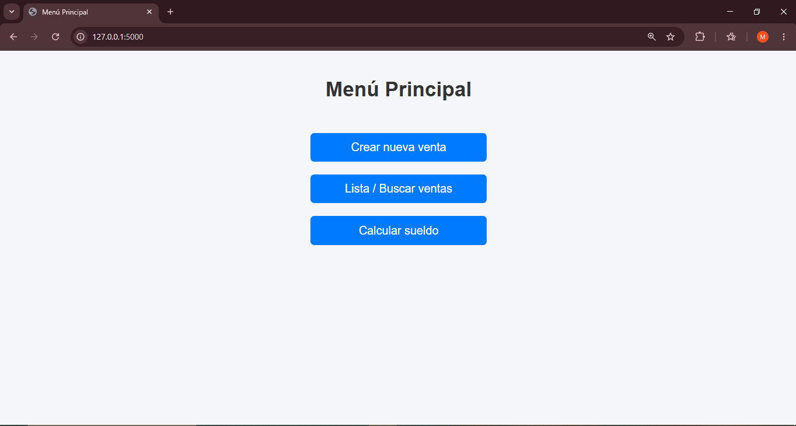
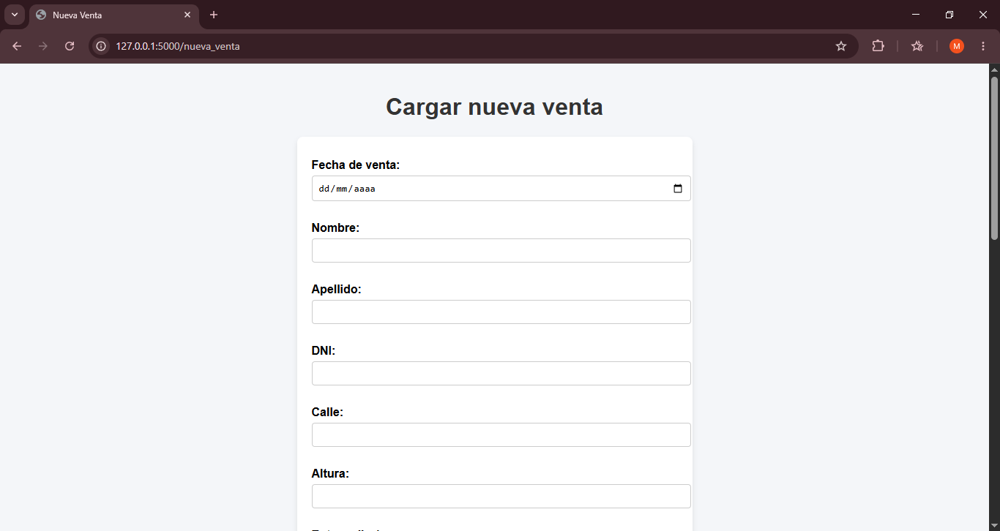
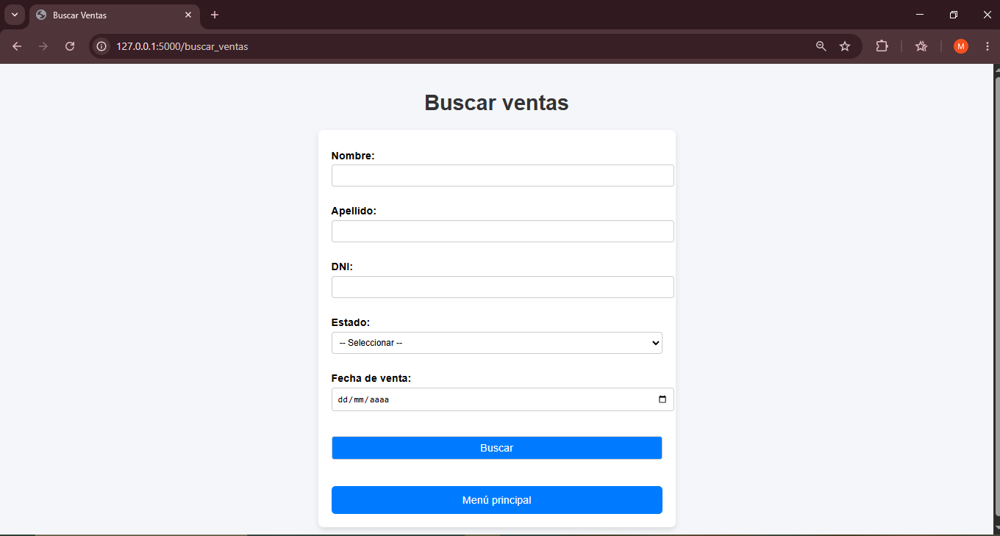
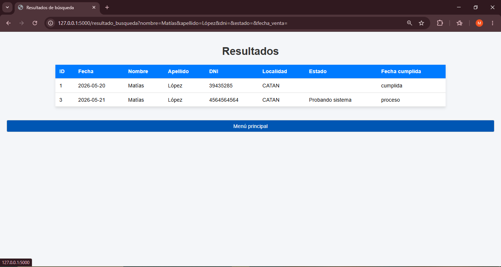
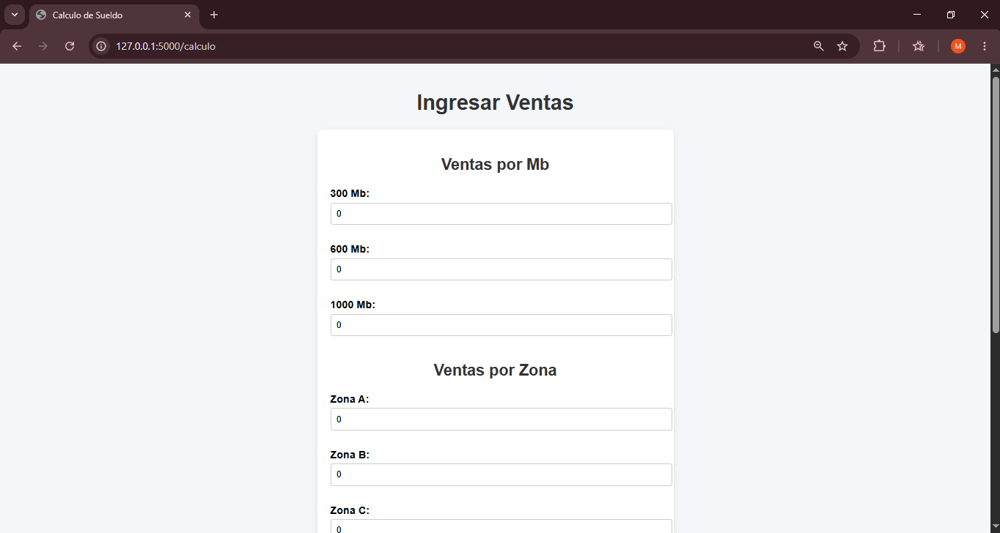
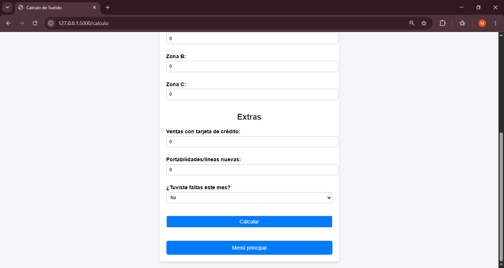

# 📊 Sistema de Ventas y Cálculo de Sueldos

Aplicación web desarrollada con **Flask** y **MySQL** para gestionar ventas y calcular sueldos de empleados.  
Este proyecto forma parte de mi portfolio y está pensado para mostrar integración entre backend, frontend y base de datos.

---

## 🚀 Características
- Registro de ventas con filtros avanzados (nombre, DNI, localidad, etc.).
- Cálculo automático de sueldos con extras (viáticos, portabilidades, nuevas líneas, tarjeta de crédito).
- Interfaz con formularios y tablas estilizadas.
- Navegación clara con barra de menú.
- Base de datos MySQL incluida (`schema.sql`).

---

## 🛠️ Instalación

### 1. Clonar el repositorio
```bash
git clone https://github.com/matilopez912/mi-sistema-ventas
cd mi-sistema-ventas

2. Crear entorno virtual

python -m venv venv

3. Activar entorno virtual

Windows (PowerShell):
venv\Scripts\activate

Linux/Mac:
source venv/bin/activate

4. Instalar dependencias

pip install -r requirements.txt

5. Configurar base de datos

Crear una base de datos en MySQL.

Importar el archivo schema.sql.

6. Ejecutar la aplicación

flask run
La aplicación estará disponible en http://127.0.0.1:5000.

📂 Estructura del proyecto

mi-sistema-ventas/
│── app.py              # Archivo principal Flask
│── schema.sql          # Script de base de datos
│── requirements.txt    # Dependencias del proyecto
│── templates/          # HTML (Jinja2)
│── static/             # CSS y recursos estáticos
│── README.md           # Documentación


## 📸 Capturas de pantalla

### Menú principal


### Formulario de ventas


### Filtro de ventas



### Cálculo de sueldos


![Resultado comisiones](docs/resultado_calculo_comisiones.png

🤝 Contribuciones
Este proyecto es parte de mi portfolio, pero cualquier sugerencia o mejora es bienvenida.

---